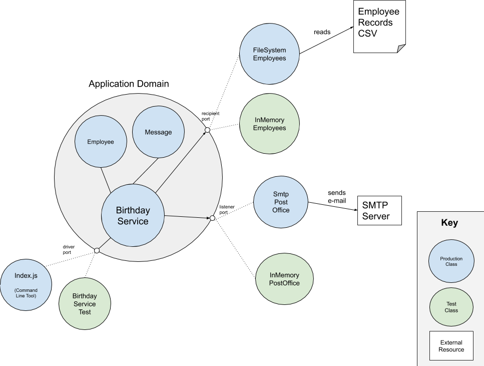

# Birthday Greetings Kata

An implementation of [Matteo Vaccari's Birthday Greetings Kata](http://matteo.vaccari.name/blog/archives/154) in Node JS.  I created this project 
as an opportunity to re-acquaint myself with NodeJS, and chose this kata as it was relatively small.

This illustrates the Hexagonal Architecture (also known as "Ports and Adapters") pattern as described by 
Alistair Cockburn.

References:

- [Description](https://alistair.cockburn.us/hexagonal-architecture/) at Alistair Cockburn's web site
- [FAQ](https://web.archive.org/web/20170925184018/http://alistair.cockburn.us/Hexagonal+Architecture+FAQ) from the Wayback Archive

## Design Overview

This image shows a sample picture of the ports and adapters design.  The classes inside the circle are the application domain. 
The circles along the edge of the circle are the ports.  The rectangles outside the circle are the adapter implementations.  The external 
processes or resources are shown in white.  Production classes are shown in blue and test classes are shown in green, however 
sometimes the test adapter implementations can be useful in production use cases as well (e.g. in-memory caching, running in 
degraded service when external resources are unavailable, etc.) 

In this example, there are three ports:

- The `Employees` repository is a source for obtaining information about `Employee`s. See the `FileSystemEmployees` and the `InMemoryEmployees` implementations in the tests.
- The `Post Office` is a recipient port used for sending e-mails.  The `SmtpPostOffice` here is a skeleton implementation which would hold the code to communicate to an e-mail server over SMTP.  There is also an in-memory version in the tests called the `InMemoryPostOffice`. 
- The `BirthdayService` has the driver port for interacting with the system both in tests and production.

The `index.js` file is the main application entry point which creates all the production adapter implements, constructs the `BirthdayService`, 
and asks it to send the e-mails.

### Design Constraints

For this kata, I set some constraints for myself: 

- Minimal dependency on external packages. So far this uses `jest` for testing, but no CSV or other libraries.

### Asynchronous Design

This code now runs asynchronously using Promises.  All file reading activity happens at the start of the application 
so that the `FileSystemRepository` is handed an already-resolved list of rows.

### Maybe TODOs

- Contract tests for different adapters? (file system vs in memory repository, etc.)
- Fully implement the SmtpPostOffice using something like `nodemailer`  
- Instead of using JS's `Date`, use another type that represents a calendar day and not a timestamp?
